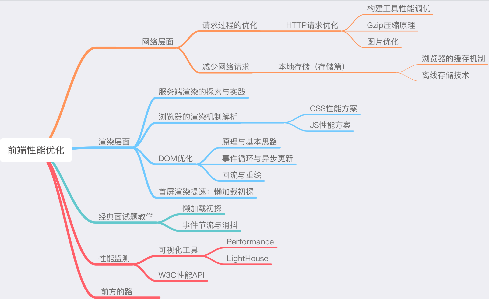

## 我们将这个过程切分为如下的过程片段：
- DNS 解析
- TCP 连接
- HTTP 请求抛出
- 服务端处理请求，HTTP 响应返回
- 浏览器拿到响应数据，解析响应内容，把解析的结果展示给用户

`大家谨记，我们任何一个用户端的产品，都需要把这 5 个过程滴水不漏地考虑到自己的性能优化方案内、反复权衡，从而打磨出用户满意的速度。`

# 从原理到实践：各个击破
- 我们接下来要做的事情，就是针对这五个过程进行分解，各个提问，各个击破。
  
  `具体来说，DNS 解析花时间，能不能尽量减少解析次数或者把解析前置？能——浏览器 DNS 缓存和 DNS prefetch。TCP 每次的三次握手都急死人，有没有解决方案？有——长连接、预连接、接入 SPDY 协议。如果说这两个过程的优化往往需要我们和团队的服务端工程师协作完成，前端单方面可以做的努力有限，那么 HTTP 请求呢？——在减少请求次数和减小请求体积方面，我们应该是专家！再者，服务器越远，一次请求就越慢，那部署时就把静态资源放在离我们更近的 CDN 上是不是就能更快一些？`
  
  以上提到的都是网络层面的性能优化。再往下走就是浏览器端的性能优化——这部分涉及资源加载优化、服务端渲染、浏览器缓存机制的利用、DOM 树的构建、网页排版和渲染过程、回流与重绘的考量、DOM 操作的合理规避等等——这正是前端工程师可以真正一展拳脚的地方。学习这些知识，不仅可以帮助我们从根本上提升页面性能，更能够大大加深个人对浏览器底层原理、运行机制的理解，一举两得！



# 二、网络篇 1：webpack 性能调优与 Gzip 原理
从现在开始，我们进入网络层面的性能优化世界。

大家可以从第一节的示意图中看出，我们从输入 URL 到显示页面这个过程中，涉及到网络层面的，有三个主要过程：
- DNS 解析
- TCP 连接
- HTTP 请求/响应

`  对于 DNS 解析和 TCP 连接两个步骤，我们前端可以做的努力非常有限。相比之下，HTTP 连接这一层面的优化才是我们网络优化的核心。因此我们开门见山，抓主要矛盾，直接从 HTTP 开始讲起。`
### HTTP 优化有两个大的方向：
- 减少请求次数
- 减少单次请求所花费的时间

`这两个优化点直直地指向了我们日常开发中非常常见的操作——资源的压缩与合并。没错，这就是我们每天用构建工具在做的事情。而时下最主流的构建工具无疑是 webpack，所以我们这节的主要任务就是围绕业界霸主 webpack 来做文章。`
## webpack 的性能瓶颈
### webpack 的优化瓶颈，主要是两个方面：
- webpack 的构建过程太花时间
- webpack 打包的结果体积太大

## webpack 优化方案
### 1. 构建过程提速策略
####  1.1 不要让 loader 做太多事情——以 babel-loader 为例
bable-loader 无疑是强大的，但它也是慢的。
最常见的优化方式是，用include或exclude来帮我们避免不必要的转译，比如webpack官方在介绍babel-loader时给出的示例：
```js
module:{
    rules:[
        {
            test:/\.js$/,
            exclude:/(node_modules|bower_components)/,
            use:{
                loader:'babel-loader',
                options:{
                    presets:['@babel/preser-env']
                }
            }
        }
    ]
}
```
这段代码帮我们规避了对庞大的 node\_modules 文件夹或者 bower\_components 文件夹的处理。但通过限定文件范围带来的性能提升是有限的。除此之外，如果我们选择开启缓存将转译结果缓存至文件系统，则至少可以将 babel-loader 的工作效率提升两倍。要做到这点，我们只需要为 loader 增加相应的参数设定：
```js
loader: 'babel-loader?cacheDirectory=true'
```
- 以上都是在讨论针对 loader 的配置，但我们的优化范围不止是 loader 们。

`举个🌰，尽管我们可以在 loader 配置时通过写入 exclude 去避免 babel-loader 对不必要的文件的处理，但是考虑到这个规则仅作用于这个 loader，像一些类似 UglifyJsPlugin 的 webpack 插件在工作时依然会被这些庞大的第三方库拖累，webpack 构建速度依然会因此大打折扣。所以针对这些庞大的第三方库，我们还需要做一些额外的努力。`

####  1.2不要放过第三方库
`第三方库以 node\_modules为代表，它们庞大得可怕，却又不可或缺。`
- 处理第三方库的姿势有很多，其中，Externals 不够聪明，一些情况下会引发重复打包的问题；而 CommonsChunkPlugin 每次构建时都会重新构建一次 vendor；出于对效率的考虑，我们这里为大家推荐 DllPlugin。
- DllPlugin 是基于 Windows 动态链接库（dll）的思想被创作出来的。**这个插件会把第三方库单独打包到一个文件中，这个文件就是一个单纯的依赖库。这个依赖库不会跟着你的业务代码一起被重新打包，只有当依赖自身发生版本变化时才会重新打包**
  
用 DllPlugin 处理文件，要分两步走：
  - 基于 dll 专属的配置文件，打包 dll 库
  - 基于 webpack.config.js 文件，打包业务代码

  `  以一个基于 React 的简单项目为例，我们的 dll 的配置文件可以编写如下：`
```js
   const path = require('path');
   const webpack = require('webpack');
   module.exports = {
       entry:{
           // 依赖的库数组
           vendor:[
               'prop-types',
               'babel-polyfill',
               'react',
               'react-dom',
               'react-router-dom'
           ]
       },
       output:{
           path:path.join(__dirname,'dist'),
           filename:'[name].js',
           library:'[name]_[hash]',
       },
       plugins:[
           new webpack.DllPlugin({
               // DllPlugin的name属性需要和libary保持一致
               name:'[name]_[hash]',
               path:path.join(__dirname,'dist','[name]-manifest.json'),
               // context需要和webpack.config.js保持一致
               context:__dirname,
           })
       ]
   }
```
编写完成之后，运行这个配置文件，我们的dist文件夹里会出现两个文件：
```js
vendor-manifest.json
vendor.js
```
vendor.js 不必解释，是我们第三方库打包的结果。这个多出来的 vendor-manifest.json，则用于描述每个第三方库对应的具体路径，我这里截取一部分给大家看下：
```json
{
  "name": "vendor_397f9e25e49947b8675d",
  "content": {
    "./node_modules/core-js/modules/_export.js": {
      "id": 0,
        "buildMeta": {
        "providedExports": true
      }
    },
    "./node_modules/prop-types/index.js": {
      "id": 1,
        "buildMeta": {
        "providedExports": true
      }
    }
  }
}  
```
`随后，我们只需在 webpack.config.js 里针对 dll 稍作配置：`
```js
const path = require('path');
const webpack = require('webpack')
module.exports = {
  mode: 'production',
  // 编译入口
  entry: {
    main: './src/index.js'
  },
  // 目标文件
  output: {
    path: path.join(__dirname, 'dist/'),
    filename: '[name].js'
  },
  // dll相关配置
  plugins: [
    new webpack.DllReferencePlugin({
      context: __dirname,
      // manifest就是我们第一步中打包出来的json文件
      manifest: require('./dist/vendor-manifest.json'),
    })
  ]
}
```
`一次基于 dll 的 webpack 构建过程优化，便大功告成了！`
#### 1.3 Happypack——将 loader 由单进程转为多进程
`大家知道，webpack是单线程的，就算此刻存在多个任务，你也只能排队一个接一个地等待处理。这是 webpack 的缺点，好在我们的 CPU 是多核的，Happypack 会充分释放 CPU 在多核并发方面的优势，帮我们把任务分解给多个子进程去并发执行，大大提升打包效率。`
- HappyPack 的使用方法也非常简单，只需要我们把对 loader 的配置转移到 HappyPack 中去就好，我们可以手动告诉 HappyPack 我们需要多少个并发的进程：
```js
const HappyPack = require('happypack')
// 手动创建进程池
const happyThreadPool =  HappyPack.ThreadPool({ size: os.cpus().length })

module.exports = {
  module: {
    rules: [
      ...
      {
        test: /\.js$/,
        // 问号后面的查询参数指定了处理这类文件的HappyPack实例的名字
        loader: 'happypack/loader?id=happyBabel',
        ...
      },
    ],
  },
  plugins: [
    ...
    new HappyPack({
      // 这个HappyPack的“名字”就叫做happyBabel，和楼上的查询参数遥相呼应
      id: 'happyBabel',
      // 指定进程池
      threadPool: happyThreadPool,
      loaders: ['babel-loader?cacheDirectory']
    })
  ],
}
```

# 构建结果体积压缩
### 1. 文件结构可视化，找出导致体积过大的原因